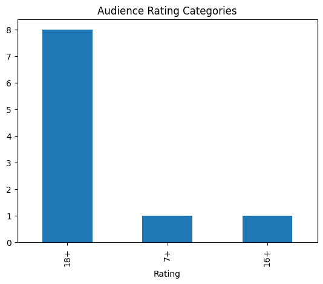
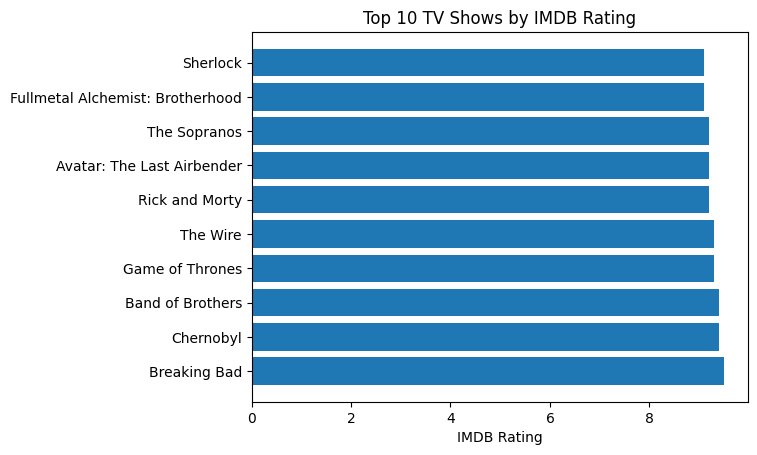

# Netflix TV Shows Data Analysis

## Project Overview
This project analyzes Netflix TV Shows dataset using Python and Google Colab.

## Tools Used
- Python
- Pandas
- Matplotlib
- Google Colab

## Steps Performed
- Data Cleaning
- Exploratory Data Analysis
- Data Visualization

  ## 📊 Visualizations

### TAudience Rating Categories

### Rating Distribution

## Author
Chetna Pal
